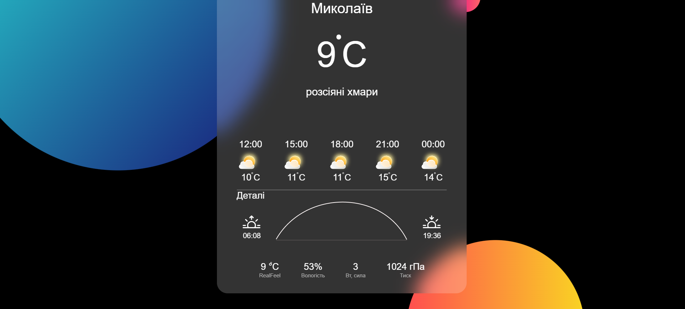

# Weather App Widget 🌤️

A modern and stylish weather widget designed with a **Glassmorphism** aesthetic. This application fetches real-time weather data and hourly forecasts using the OpenWeatherMap API.

## ✨ Features
* **Real-time Data:** Displays current temperature, humidity, pressure, and wind force.
* **Hourly Forecast:** Interactive timeline showing weather trends for the next few hours.
* **Glassmorphism UI:** Stunning visual design using CSS backdrop filters and semi-transparent layers.
* **Dynamic Time Conversion:** Automatically converts UNIX timestamps into readable formats (Sunrise/Sunset/Timeline).
* **Modern JS:** Built using asynchronous programming (Async/Await) and Fetch API.

## 🛠️ Tech Stack
* **HTML5** – Semantic structure.
* **CSS3** – Flexbox layout, Glassmorphism effects, and custom typography.
* **JavaScript (ES6+)** – DOM manipulation and API integration.
* **API** – [OpenWeatherMap API](https://openweathermap.org/api).

## 🚀 Getting Started
1. Clone the repository:
   ```bash
   git clone [https://github.com/your-username/weather-app-widget.git](https://github.com/your-username/weather-app-widget.git)

## 📸 Preview

### Desktop
